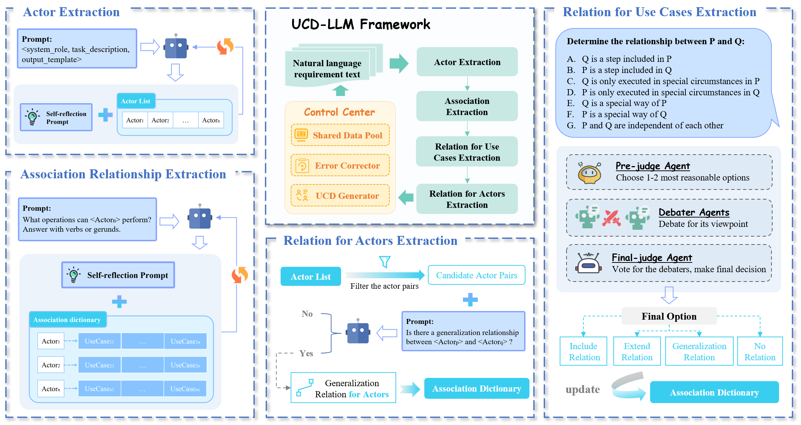

# UCD-LLM 🧠📊

**UCD-LLM**: A Multi-Agent Framework for Automated Use Case Diagram Modeling with Large Language Models


## 📖 Overview

UCD-LLM is a novel multi-agent framework that leverages Large Language Models (LLMs) to automatically extract modeling elements and construct UML use case diagrams from natural language requirements. It addresses the challenges of ambiguity, incompleteness, and complex relationship extraction in traditional requirement modeling methods.



## ✨ Features

- **Multi-Agent Architecture**: Four specialized agents for extracting actors, associations, use case relationships, and actor relationships.
- **Self-Reflection Mechanism**: Reduces LLM hallucinations through iterative validation.
- **Debate Mechanism**: Simulates human modeler discussions to resolve ambiguous relationships.
- **End-to-End Pipeline**: From natural language text to structured PlantUML code and visual diagrams.
- **No Training Required**: Built on pre-trained LLMs with prompt engineering, no fine-tuning needed.

## 🛠️ Installation

```bash
git clone https://github.com/UCD-LLM/UCD-LLM.git
cd UCD-LLM
pip install -r requirements.txt
# Edit config.py to add your API keys for supported LLM providers
```

## 📁 Project Structure
```bash
UCD-LLM/
├── datasets/
│   ├── 5_RMC/  # Raw text of the 5 classic Requirement Modeling Cases
│   ├── 5_ideal_Elements/ # Ideal modeling element annotations for the 5 cases
│   ├── 60_artificial/ # Manually constructed ReqUCD60 requirement documents
│   └── 60_ideal_UCD/  # Ideal use case diagram annotations for ReqUCD60
├── baseline/
│   ├── Deepseek_single/ 
│   ├── GLM_single/ 
│   ├── Qwen_single/ 
│   ├── IT4RE/ 
│   ├── single_LLM.py # Implementation of single-model baseline methods
│   ├── single_LLM_template.txt # Prompt templates for single-model baselines
│   └── config.py
├── src/
│   ├── llm_utils.py # Utility functions for LLM API calls        
│   ├── config.py 
│   ├── UCDAgent.py # Multi-agent implementation
│   └── main.py  # Main entry point script
├── eval/
│   ├── ideal_eval/ 
│   │   ├── ideal_UCD_eval.py # Evaluation algorithm implementation
│   │   ├── ideal_eval_result.py # Evaluation algorithm implementation
│   │   ├── config.py
│   │   ├── 5_RMC_ideal_eval_results.jsonl # Evaluation results for 5 cases
│   │   └── ideal_eval_results.jsonl # Evaluation results for ReqUCD60
│   └── ablation_eval/
├── prompts/  # Directory for prompt templates
├── few_shot_examples/   # Few-shot learning examples
├── output/   # UCD-LLM model outputs
├── ablation_output/ # Ablation experiment outputs
├── result_visulizatoin/ # Scripts and charts for result visualization
└── ...   # Other files, etc.
```

## 📊 Results

UCD-LLM outperforms traditional methods and zero-shot LLM baselines:

**FEF (Functional Entity F1):** Up to 0.906 (vs. 0.246 for IT4RE)

**RNF (Relation Network F1):** Up to 0.693

Supports extraction of include, extend, and generalization relationships

See the paper for detailed ablation studies and case study.

## 📧 Contact

For questions or collaborations, please contact:
hwl@tongji.edu.cn
